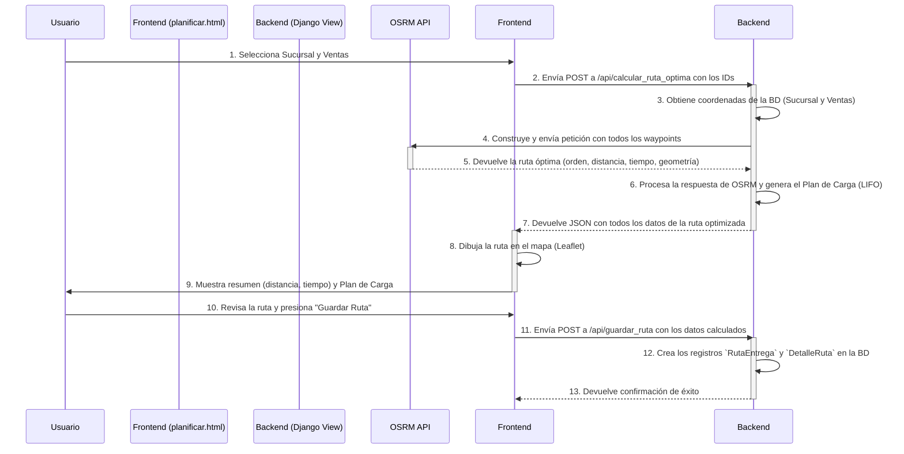
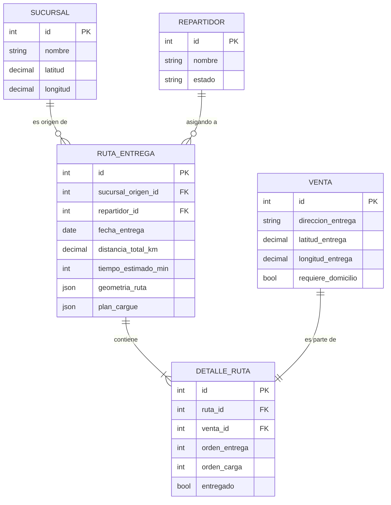
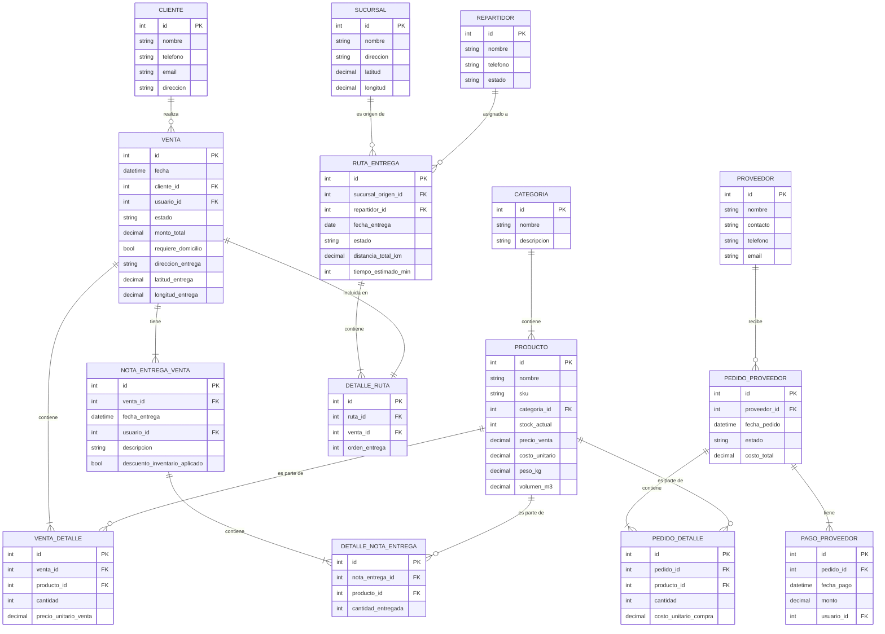
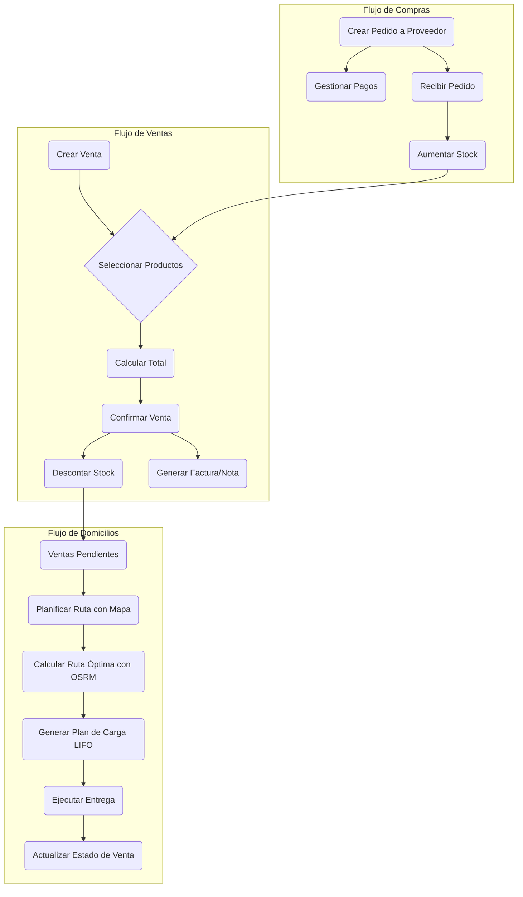

# Synkro - Sistema de Gestión Empresarial

Synkro es un sistema de gestión empresarial (ERP) robusto y completo, desarrollado con Django. Está diseñado para centralizar y optimizar las operaciones clave de un negocio, incluyendo inventario, ventas, clientes, proveedores y una logística de domicilios avanzada con optimización de rutas.

## Tabla de Contenidos

1.  [Funcionalidades Principales](#-funcionalidades-principales)
2.  [Módulo Avanzado de Domicilios](#-módulo-avanzado-de-domicilios)
3.  [Modelo Matemático de Optimización](#-modelo-matemático-de-optimización-de-rutas)
4.  [Arquitectura del Sistema](#-arquitectura-del-sistema)
5.  [Pila Tecnológica](#-pila-tecnológica)
6.  [Instalación y Configuración](#-instalación-y-configuración)
7.  [Uso del Sistema](#-uso-del-sistema)
8.  [Testing](#-testing)

---

## Funcionalidades Principales

### Autenticación y Dashboard
-   **Sistema de Autenticación Seguro**: Login/logout con protección de rutas.
-   **Dashboard Centralizado**: Ofrece una vista rápida de estadísticas clave como ventas del día, total de productos, y alertas de stock bajo.

### Gestión de Inventario
-   **CRUD de Productos y Categorías**: Administración completa de productos, incluyendo SKU, precios, costos, y asignación a categorías.
-   **Control de Stock Automatizado**: El inventario se actualiza automáticamente con cada venta completada y cada recepción de pedido de proveedor.
-   **Alertas de Stock Bajo**: Indicadores visuales y notificaciones en el dashboard para productos que necesitan reposición.
-   **Cálculo de Ganancias**: El sistema calcula la ganancia unitaria y el margen de ganancia por producto.

### Gestión de Ventas
-   **Punto de Venta (POS) Intuitivo**: Interfaz con carrito de compras que calcula subtotales, impuestos y totales automáticamente.
-   **Historial de Ventas**: Registro detallado de todas las transacciones, con filtros por cliente y estado.
-   **Gestión de Estados**: Ciclo de vida completo de la venta (`Borrador`, `Pendiente de Pago`, `Pagada y Pendiente de Entrega`, `Completada`, `Cancelada`).
-   **Entregas Parciales (Notas de Entrega)**: Permite registrar entregas parciales de una venta, descontando el inventario de forma gradual y manteniendo un seguimiento detallado.

### Gestión de Clientes (CRM)
-   **CRUD de Clientes**: Base de datos centralizada de clientes con información de contacto.
-   **Historial de Compras**: Cada venta se asocia a un cliente, permitiendo un seguimiento de su actividad.

### Gestión de Proveedores y Compras
-   **CRUD de Proveedores**: Administra la información de contacto de los proveedores.
-   **Órdenes de Compra**: Crea y gestiona pedidos a proveedores, detallando productos, cantidades y costos.
-   **Control de Pagos**: Registra pagos parciales o totales a proveedores, manteniendo un seguimiento del saldo pendiente.

---

## Módulo Avanzado de Domicilios

El sistema incluye un módulo logístico completo para la gestión de entregas a domicilio.

### 1. **Planificación de Rutas Inteligente**
-   **Mapa Interactivo (Leaflet.js)**: Visualiza todas las ventas pendientes de entrega en un mapa.
-   **Selección Múltiple**: Elige qué entregas incluir en una ruta.
-   **Optimización de Ruta (OSRM)**: Calcula la secuencia de entrega más eficiente en tiempo y distancia, considerando el tráfico en tiempo real.
-   **Estadísticas Clave**: Muestra distancia total, tiempo estimado, y peso/volumen total de la carga.

### 2. **Plan de Carga LIFO (Last-In, First-Out)**
-   **Generación Automática**: Una vez optimizada la ruta, el sistema crea un **plan de carga** que indica el orden en que los productos deben ser cargados en el vehículo.
-   **Lógica LIFO**: El último producto a entregar es el primero en cargarse, asegurando que los paquetes para las primeras paradas estén siempre accesibles.

### 3. **Ejecución y Seguimiento de Ruta**
-   **Gestión de Estados de Ruta**: `Planificada` -> `En Curso` -> `Completada`.
-   **Tracking en Tiempo Real**: Marca cada entrega como completada en el mapa, actualizando el progreso de la ruta.
-   **Validaciones**: El sistema asegura que todas las paradas se completen antes de finalizar la ruta.

### 4. **Reportes PDF y Análisis con IA (Gemini)**
-   **Plan de Carga en PDF**: Genera un documento profesional para el repartidor con el mapa, la secuencia de paradas, y el plan de carga LIFO detallado.
-   **Análisis Inteligente de Carga**: Integrado con **Google Gemini**, el sistema analiza la carga (peso, volumen, compatibilidad de productos) y añade al PDF un resumen ejecutivo, nivel de complejidad, y recomendaciones priorizadas sobre seguridad y eficiencia.

---

## 📐 Modelo Matemático de Optimización de Rutas

Este documento describe el modelo matemático y el flujo de procesos implementado en el sistema para calcular la ruta óptima para las entregas a domicilio. El objetivo es minimizar el tiempo y la distancia total del recorrido, asegurando una logística eficiente.

### 1. El Problema de Optimización: VRP

El problema central que se resuelve es una variante del **Problema del Viajante (TSP - Traveling Salesperson Problem)**, conocido más específicamente como el **Problema de Enrutamiento de Vehículos (VRP - Vehicle Routing Problem)**.

En su forma más simple, el VRP busca encontrar el conjunto óptimo de rutas para una flota de vehículos que debe atender a un conjunto de clientes. En nuestro caso, se simplifica a un solo vehículo por ruta, lo que lo asemeja mucho al TSP.

El objetivo es determinar la secuencia de visitas a los clientes (puntos de entrega) que minimice una función de costo, generalmente la distancia total recorrida o el tiempo total de viaje.

#### Componentes del Modelo

- **Nodos (Nodes)**: Son los puntos geográficos de interés.
  - **Depósito (Depot)**: Un único punto de inicio y fin de la ruta. En nuestro sistema, corresponde a la `Sucursal` seleccionada.
  - **Clientes (Customers)**: Un conjunto de puntos que deben ser visitados. Corresponden a las direcciones de entrega de las `Ventas` seleccionadas.

- **Arcos (Arcs)**: Representan los trayectos en la red vial que conectan los nodos entre sí. Cada arco tiene un costo asociado (`c_ij`), que en este modelo es el **tiempo de viaje** o la **distancia** entre el nodo `i` y el nodo `j`.

- **Objetivo**: Minimizar el costo total de la ruta.

### 2. Formulación Matemática

El problema se puede formular matemáticamente de la siguiente manera:

Sea **G = (N, A)** un grafo donde **N** es el conjunto de nodos (depósito + clientes) y **A** es el conjunto de arcos.

- **N = {0, 1, 2, ..., n}**, donde `0` es el depósito (la sucursal) y `1` a `n` son los clientes (las entregas).
- **c_ij**: El costo (tiempo o distancia) de viajar del nodo `i` al nodo `j`.

#### Variable de Decisión

Se define una variable binaria:

```
x_ij = 1, si la ruta va directamente del nodo i al nodo j
x_ij = 0, en caso contrario
```

#### Función Objetivo

El objetivo es minimizar la suma de los costos de todos los arcos seleccionados en la ruta.

$$
\text{Minimizar } Z = \sum_{i \in N} \sum_{j \in N, i \neq j} c_{ij} x_{ij}
$$

#### Restricciones (Constraints)

1.  **Visitar cada cliente una sola vez**: Cada nodo de cliente debe tener exactamente un arco de entrada y un arco de salida.
    $$
    \sum_{i \in N, i \neq j} x_{ij} = 1, \quad \forall j \in \{1, ..., n\}
    $$
    $$
    \sum_{j \in N, i \neq j} x_{ij} = 1, \quad \forall i \in \{1, ..., n\}
    $$

2.  **Salida y regreso al depósito**: El vehículo debe salir del depósito y finalmente regresar a él.
    $$
    \sum_{j=1}^{n} x_{0j} = 1
    $$
    $$
    \sum_{i=1}^{n} x_{i0} = 1
    $$

3.  **Eliminación de Sub-rutas**: Se deben añadir restricciones para asegurar que la solución sea una única ruta continua y no múltiples circuitos desconectados. (Esta es la parte más compleja del VRP y es manejada automáticamente por el solver externo).

### 3. Herramienta Externa: OSRM (Open Source Routing Machine)

En lugar de implementar un solver para este complejo problema desde cero, el sistema delega el cálculo a una herramienta externa altamente especializada: **OSRM (Open Source Routing Machine)**.

La vista `api_calcular_ruta_optima` implementa esta lógica:

1.  **Recopila Coordenadas**: Obtiene las coordenadas de latitud y longitud de la `Sucursal` de origen y de todas las `Ventas` seleccionadas.
2.  **Construye la Petición**: Forma una URL para la API pública de OSRM. Esta URL contiene las coordenadas de todos los puntos (depósito y clientes) en un formato específico.
    ```python
    # Ejemplo de la construcción de la URL en el código
    coords_str = ';'.join([f"{w[1]},{w[0]}" for w in waypoints])
    url = f"https://router.project-osrm.org/route/v1/driving/{coords_str}"
    ```
3.  **Consulta a OSRM**: Realiza una petición GET al servicio de OSRM. OSRM utiliza los datos de **OpenStreetMap** y algoritmos eficientes (como Contraction Hierarchies) para resolver el problema del viajante sobre una red vial real, considerando factores como el tráfico.
4.  **Recibe la Solución**: OSRM devuelve un archivo JSON con la solución óptima, que incluye:
    - La secuencia ordenada de los `waypoints` (puntos de entrega).
    - La geometría de la ruta para dibujarla en un mapa.
    - La distancia total (`distance`).
    - El tiempo total estimado (`duration`).
    - Instrucciones de navegación paso a paso.

### 4. Flujo del Proceso de Planificación

El proceso completo, desde la interfaz de usuario hasta la visualización de la ruta, sigue estos pasos.



### 5. Consideraciones Logísticas Adicionales

El modelo no solo calcula la ruta, sino que también añade lógica de negocio crucial.

#### Plan de Cargue LIFO (Last-In, First-Out)

Una vez que OSRM devuelve el orden óptimo de las paradas de entrega, el sistema genera un **Plan de Cargue**. Este plan se basa en el principio LIFO:

> **El último paquete en ser entregado debe ser el primero en ser cargado en el vehículo.**

Esto asegura que los paquetes para las primeras entregas estén siempre accesibles y no bloqueados por la mercancía de entregas posteriores.

El código genera esto invirtiendo el orden de entrega para obtener el orden de carga:

```python
# Lógica conceptual en api_calcular_ruta_optima
orden_entrega = [1, 2, 3, ..., n]
orden_carga = reversed(orden_entrega) # [n, ..., 3, 2, 1]
```

#### Limitaciones y Futuras Mejoras

- **Capacidad del Vehículo**: El modelo actual calcula el peso y volumen total de la carga (`peso_total_kg`, `volumen_total_m3`), pero **no utiliza estos valores como una restricción** en el cálculo. Es decir, asume que el vehículo tiene capacidad infinita. Una mejora futura sería implementar un VRP con Restricciones de Capacidad (CVRP), que podría dividir las entregas en múltiples rutas si se excede la capacidad de un vehículo.
- **Ventanas de Tiempo**: El modelo no considera ventanas horarias de entrega para los clientes (ej: "entregar solo de 9 AM a 12 PM").

### 6. Modelo de Datos Relevante

Las siguientes entidades de la base de datos son fundamentales para el módulo de domicilios.



### 7. Conclusión del Modelo

La implementación actual ofrece una solución robusta y eficiente para la optimización de rutas de entrega, combinando un modelo matemático sólido con una herramienta externa especializada (OSRM). Esto permite al sistema no solo encontrar la ruta más corta, sino también aplicar lógica de negocio valiosa como el plan de carga LIFO. Las futuras mejoras se centrarán en añadir restricciones más complejas como la capacidad del vehículo y las ventanas de tiempo de entrega.

---

## Arquitectura del Sistema

### Arquitectura Monolítica
Synkro está construido sobre una **arquitectura monolítica**. Esto significa que todos los componentes del sistema —el backend, la lógica de negocio y la interfaz de usuario (renderizada en el servidor)— están desarrollados y desplegados como una única aplicación Django.

Ventajas de este enfoque para Synkro:
-   **Simplicidad en el Desarrollo**: Un único código base facilita la gestión y el desarrollo de nuevas funcionalidades.
-   **Despliegue Sencillo**: La aplicación completa se despliega como una sola unidad, simplificando el proceso de puesta en producción.
-   **Rendimiento**: La comunicación interna entre componentes es directa y rápida, sin la latencia de las llamadas de red presentes en arquitecturas de microservicios.

### Modelo de Datos Centralizado (Diagrama ER)

El corazón del sistema es su modelo de datos relacional, gestionado por el ORM de Django. El siguiente diagrama Entidad-Relación (ER) ilustra la estructura completa de la base de datos y las interconexiones entre todos los modelos.



### Diagrama de Flujo de Funcionalidades Clave
El siguiente diagrama ilustra los flujos de trabajo más importantes del sistema:



---

## Pila Tecnológica

-   **Backend**: Python 3, Django, Django REST Framework.
-   **Base de Datos**: SQLite (para desarrollo), compatible con PostgreSQL (para producción).
-   **Frontend**: Django Templates, HTML5, CSS3, JavaScript.
-   **UI/UX**: Bootstrap 5, Font Awesome, Leaflet.js (mapas).
-   **APIs Externas**: OSRM (rutas), Nominatim (geocodificación), Google Gemini (análisis IA).
-   **Reportes**: ReportLab (generación de PDFs).

---

## Instalación y Configuración

### 1. Prerrequisitos
-   Python 3.x
-   Git

### 2. Clonar el Repositorio
```bash
git clone <URL_DEL_REPOSITORIO>
cd synkro
```

### 3. Configurar Entorno Virtual
```bash
# En Windows
python -m venv venv
venv\Scripts\activate

# En macOS/Linux
python3 -m venv venv
source venv/bin/activate
```

### 4. Instalar Dependencias
```bash
pip install -r requirements.txt
```

### 5. Configurar Variables de Entorno
Crea un archivo `.env` en la raíz del proyecto y añade tu clave de API para la función de análisis inteligente. **No incluyas esta clave directamente en el código.**

```env
# Archivo: .env
GEMINI_API_KEY="TU_API_KEY_DE_GEMINI"
```

### 6. Aplicar Migraciones
```bash
python manage.py migrate
```

### 7. Crear un Superusuario
```bash
python manage.py createsuperuser
```
Sigue las instrucciones para crear tu cuenta de administrador.

### 8. Iniciar el Servidor
```bash
python manage.py runserver
```
El sistema estará disponible en `http://127.0.0.1:8000`.

---

## Uso del Sistema

### Credenciales de Demo
-   **Usuario**: `admin`
-   **Contraseña**: `admin123`

### Preparar una Demostración
Para tener un entorno limpio y con datos de ejemplo realistas, puedes usar los siguientes scripts:

1.  **Limpiar la base de datos** (mantiene solo los usuarios):
    ```bash
    python limpiar_base_datos.py
    ```

2.  **Generar datos de prueba** (productos, clientes, ventas, etc.):
    ```bash
    python generar_datos_demo.py
    ```

Este script creará un conjunto completo de datos, incluyendo ventas pendientes de domicilio con coordenadas reales en Barranquilla, Colombia, listas para ser planificadas.

### Flujo de Demo Sugerido
1.  **Dashboard**: Muestra las estadísticas iniciales.
2.  **Gestión de Productos**: Explora el catálogo, muestra las alertas de stock.
3.  **Crear una Venta**: Realiza una venta y márcala como "Requiere Domicilio".
4.  **Planificar Ruta**: Ve al módulo de domicilios, selecciona varias ventas y calcula la ruta óptima.
5.  **Analizar Ruta**: Muestra el mapa, las estadísticas y el plan de carga LIFO generado.
6.  **Descargar Plan de Carga**: Genera y muestra el PDF con el análisis de IA de Gemini.
7.  **Ejecutar Ruta**: Inicia la ruta y simula la entrega marcando paradas como completadas.
8.  **Verificar Resultados**: Muestra cómo el dashboard y los estados de las ventas se actualizan automáticamente.

---

## Testing

El proyecto incluye una suite de tests completa para asegurar la calidad y el correcto funcionamiento de la lógica de negocio.

### Cómo Ejecutar los Tests

-   **Ejecutar toda la suite**:
    ```bash
    python manage.py test
    ```
-   **Ejecutar tests de un módulo específico**:
    ```bash
    python manage.py test core
    ```

Los tests cubren:
-   Gestión de stock en ventas y pedidos.
-   Cálculos financieros (totales, saldos, ganancias).
-   Flujos de integración (compra -> stock -> venta).
-   Validaciones de negocio.

La base de datos de prueba se crea y destruye automáticamente, por lo que tus datos reales no se verán afectados.
