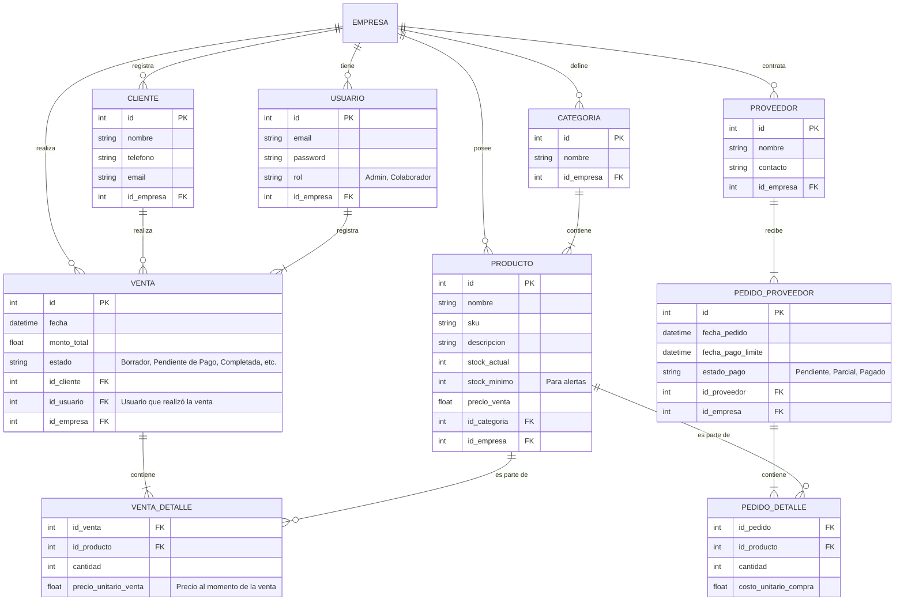
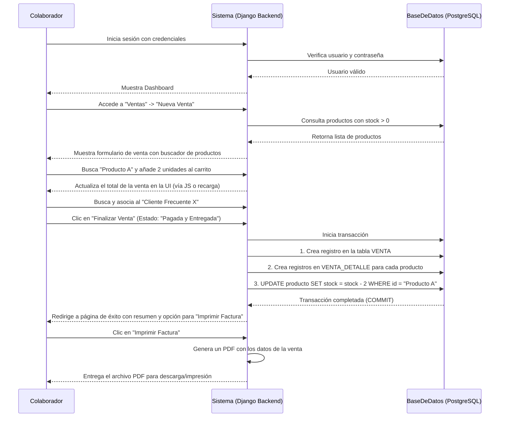

# Sistema de Gestión Empresarial (Synkro)

Este documento detalla los requerimientos y la arquitectura de un sistema de gestión empresarial multi-tenant (SaaS) enfocado en el manejo de inventario, ventas, facturación, clientes y proveedores.

## 1. Requerimientos Funcionales

### Módulo 1: Gestión de Usuarios y Empresas (SaaS Core)
- **RF1.1:** El sistema permitirá el registro de nuevas empresas. Cada empresa operará en un entorno aislado (multi-tenant).
- **RF1.2:** Cada empresa tendrá un usuario **Administrador Principal** con acceso total a la configuración y datos de su organización.
- **RF1.3:** El Administrador Principal podrá crear, modificar y eliminar cuentas de **Colaboradores** con roles y permisos específicos (ej. "Vendedor", "Almacenista").
- **RF1.4:** Todas las acciones críticas (creación de ventas, modificación de productos, etc.) deberán registrar qué usuario las realizó.

### Módulo 2: Manejo de Inventario
- **RF2.1:** **Creación de Productos:** Permitir dar de alta productos con atributos como nombre, SKU, descripción, precio de compra y precio de venta.
- **RF2.2:** **Categorización:** Permitir crear categorías y asignarlas a los productos para una mejor organización.
- **RF2.3:** **Gestión de Stock:** Añadir unidades al inventario (ej. al recibir un pedido de proveedor) y disminuir unidades automáticamente al realizar una venta.
- **RF2.4:** **Trazabilidad de Inventario:** Mantener un historial de todos los movimientos de stock (entradas, salidas, ajustes) con fecha y usuario responsable.

### Módulo 3: Manejo de Ventas y Facturas
- **RF3.1:** **Creación de Ventas:** Interfaz para registrar una nueva venta, permitiendo buscar y añadir productos del inventario.
- **RF3.2:** **Cálculo de Totales:** El sistema debe calcular automáticamente el subtotal, impuestos (configurables) y el monto total de la venta.
- **RF3.3:** **Asociación de Productos:** Vincular los productos y cantidades específicas a cada venta.
- **RF3.4:** **Estados de Venta:** Cada venta deberá tener un estado para reflejar su ciclo de vida. Se identifican los siguientes:
    - `Borrador`: Venta iniciada pero no confirmada.
    - `Pendiente de Pago`: Venta confirmada, esperando el pago del cliente.
    - `Pagada y Pendiente de Entrega`: El cliente ya pagó, pero los productos no han sido retirados.
    - `Completada`: Pagada y entregada.
    - `Cancelada`: La venta fue anulada.
- **RF3.5:** **Impresión de Facturas:** Generar un documento en formato PDF con el detalle de la venta, datos del cliente y de la empresa para su impresión y entrega.

### Módulo 4: Registro de Clientes
- **RF4.1:** **Gestión de Clientes:** Permitir el registro de clientes frecuentes con su información de contacto (nombre, teléfono, email).
- **RF4.2:** **Historial de Compras:** Asociar las ventas a los clientes para poder consultar su historial de compras.

### Módulo 5: Registro de Proveedores y Compras
- **RF5.1:** **Gestión de Proveedores:** Registrar proveedores con su información de contacto.
- **RF5.2:** **Pedidos de Mercancía:** Crear órdenes de compra a proveedores, detallando los productos y cantidades solicitadas.
- **RF5.3:** **Gestión de Pagos a Proveedores:** Registrar el estado de pago de las órdenes de compra:
    - `Pendiente de Pago`.
    - `Pagada Parcialmente` (con registro de abonos y fechas).
    - `Pagada Totalmente`.

### Módulo 6: Sistema de Alertas
- **RF6.1:** **Alerta de Stock Bajo:** Notificar al administrador cuando un producto alcance un umbral mínimo de existencias, basado en su rotación de ventas.
- **RF6.2:** **Alerta de Pagos a Proveedores:** Notificar al administrador sobre las fechas de vencimiento de los pagos pendientes a proveedores.

## 2. Requerimientos No Funcionales
- **RNF1: Rendimiento:** Las consultas y operaciones comunes (crear venta, buscar producto) deben completarse en menos de 2 segundos.
- **RNF2: Usabilidad:** La interfaz debe ser intuitiva y fácil de usar, minimizando la curva de aprendizaje para nuevos usuarios.
- **RNF3: Seguridad:**
    - Autenticación segura y gestión de contraseñas (hashing).
    - Autorización basada en roles para restringir el acceso a funcionalidades.
    - Aislamiento de datos entre las distintas empresas registradas.
- **RNF4: Escalabilidad:** La arquitectura debe soportar el crecimiento en el número de empresas, usuarios y transacciones sin degradar el rendimiento.
- **RNF5: API RESTful:** Todos los endpoints del backend deben seguir los principios de REST para facilitar la integración futura de un frontend desacoplado (React, Vue, etc.).

## 3. Requerimientos de Sistema
- **Backend:** Python con Django y Django REST Framework.
- **Base de Datos:** PostgreSQL.
- **Frontend (Inicial):** Plantillas de Django (Server-Side Rendering) con HTML, CSS y JavaScript.
- **Servidor de Aplicaciones (Producción):** Gunicorn / uWSGI.
- **Servidor Web (Producción):** Nginx.

---

## Modelo de Datos Recomendado

Este modelo de entidades y relaciones es una base sólida para el sistema. Puedes usar un visualizador de Mermaid JS para ver el gráfico.

## Flujo de Acciones del Sistema (Diagrama de Secuencia para "Crear una Venta")

Este es un flujo típico que ilustra la interacción entre el usuario y el sistema.

