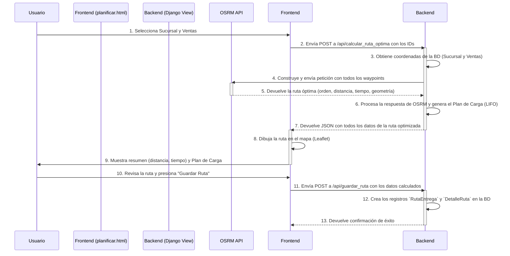
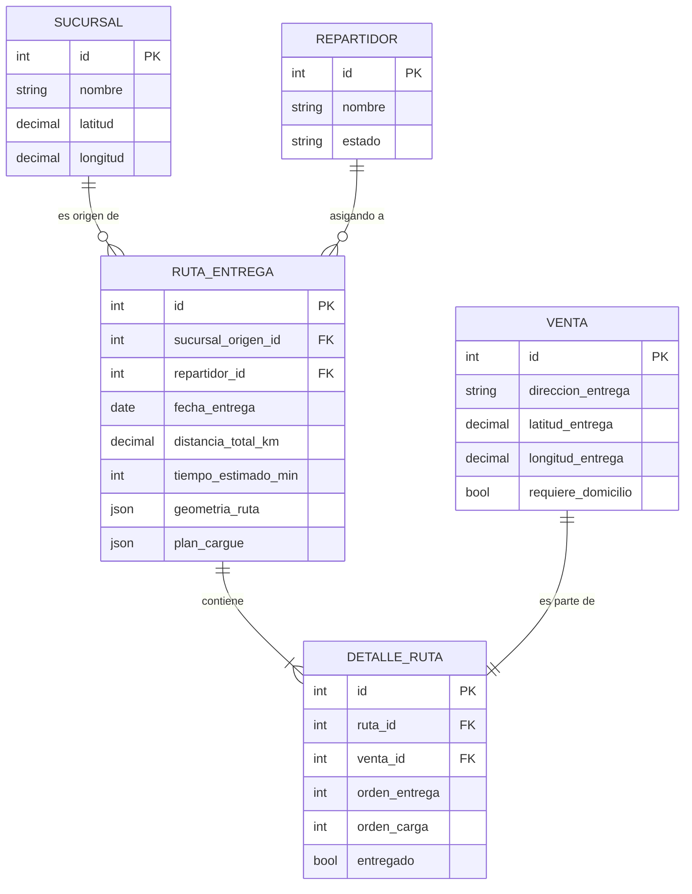

# Modelo de Optimización de Rutas de Domicilios

Este documento describe el modelo matemático y el flujo de procesos implementado en el sistema para calcular la ruta óptima para las entregas a domicilio. El objetivo es minimizar el tiempo y la distancia total del recorrido, asegurando una logística eficiente.

## 1. El Problema de Optimización: VRP

El problema central que se resuelve es una variante del **Problema del Viajante (TSP - Traveling Salesperson Problem)**, conocido más específicamente como el **Problema de Enrutamiento de Vehículos (VRP - Vehicle Routing Problem)**.

En su forma más simple, el VRP busca encontrar el conjunto óptimo de rutas para una flota de vehículos que debe atender a un conjunto de clientes. En nuestro caso, se simplifica a un solo vehículo por ruta, lo que lo asemeja mucho al TSP.

El objetivo es determinar la secuencia de visitas a los clientes (puntos de entrega) que minimice una función de costo, generalmente la distancia total recorrida o el tiempo total de viaje.

### Componentes del Modelo

- **Nodos (Nodes)**: Son los puntos geográficos de interés.
  - **Depósito (Depot)**: Un único punto de inicio y fin de la ruta. En nuestro sistema, corresponde a la `Sucursal` seleccionada.
  - **Clientes (Customers)**: Un conjunto de puntos que deben ser visitados. Corresponden a las direcciones de entrega de las `Ventas` seleccionadas.

- **Arcos (Arcs)**: Representan los trayectos en la red vial que conectan los nodos entre sí. Cada arco tiene un costo asociado (`c_ij`), que en este modelo es el **tiempo de viaje** o la **distancia** entre el nodo `i` y el nodo `j`.

- **Objetivo**: Minimizar el costo total de la ruta.

## 2. Formulación Matemática

El problema se puede formular matemáticamente de la siguiente manera:

Sea **G = (N, A)** un grafo donde **N** es el conjunto de nodos (depósito + clientes) y **A** es el conjunto de arcos.

- **N = {0, 1, 2, ..., n}**, donde `0` es el depósito (la sucursal) y `1` a `n` son los clientes (las entregas).
- **c_ij**: El costo (tiempo o distancia) de viajar del nodo `i` al nodo `j`.

### Variable de Decisión

Se define una variable binaria:

```
x_ij = 1, si la ruta va directamente del nodo i al nodo j
x_ij = 0, en caso contrario
```

### Función Objetivo

El objetivo es minimizar la suma de los costos de todos los arcos seleccionados en la ruta.

$$
\text{Minimizar } Z = \sum_{i \in N} \sum_{j \in N, i \neq j} c_{ij} x_{ij}
$$

### Restricciones (Constraints)

1.  **Visitar cada cliente una sola vez**: Cada nodo de cliente debe tener exactamente un arco de entrada y un arco de salida.
    $$
    \sum_{i \in N, i \neq j} x_{ij} = 1, \quad \forall j \in \{1, ..., n\}
    $$
    $$
    \sum_{j \in N, i \neq j} x_{ij} = 1, \quad \forall i \in \{1, ..., n\}
    $$

2.  **Salida y regreso al depósito**: El vehículo debe salir del depósito y finalmente regresar a él.
    $$
    \sum_{j=1}^{n} x_{0j} = 1
    $$
    $$
    \sum_{i=1}^{n} x_{i0} = 1
    $$

3.  **Eliminación de Sub-rutas**: Se deben añadir restricciones para asegurar que la solución sea una única ruta continua y no múltiples circuitos desconectados. (Esta es la parte más compleja del VRP y es manejada automáticamente por el solver externo).

## 3. Herramienta Externa: OSRM (Open Source Routing Machine)

En lugar de implementar un solver para este complejo problema desde cero, el sistema delega el cálculo a una herramienta externa altamente especializada: **OSRM (Open Source Routing Machine)**.

La vista `api_calcular_ruta_optima` implementa esta lógica:

1.  **Recopila Coordenadas**: Obtiene las coordenadas de latitud y longitud de la `Sucursal` de origen y de todas las `Ventas` seleccionadas.
2.  **Construye la Petición**: Forma una URL para la API pública de OSRM. Esta URL contiene las coordenadas de todos los puntos (depósito y clientes) en un formato específico.
    ```python
    # Ejemplo de la construcción de la URL en el código
    coords_str = ';'.join([f"{w[1]},{w[0]}" for w in waypoints])
    url = f"https://router.project-osrm.org/route/v1/driving/{coords_str}"
    ```
3.  **Consulta a OSRM**: Realiza una petición GET al servicio de OSRM. OSRM utiliza los datos de **OpenStreetMap** y algoritmos eficientes (como Contraction Hierarchies) para resolver el problema del viajante sobre una red vial real, considerando factores como el tráfico.
4.  **Recibe la Solución**: OSRM devuelve un archivo JSON con la solución óptima, que incluye:
    - La secuencia ordenada de los `waypoints` (puntos de entrega).
    - La geometría de la ruta para dibujarla en un mapa.
    - La distancia total (`distance`).
    - El tiempo total estimado (`duration`).
    - Instrucciones de navegación paso a paso.

## 4. Flujo del Proceso de Planificación

El proceso completo, desde la interfaz de usuario hasta la visualización de la ruta, sigue estos pasos.



## 5. Consideraciones Logísticas Adicionales

El modelo no solo calcula la ruta, sino que también añade lógica de negocio crucial.

### Plan de Cargue LIFO (Last-In, First-Out)

Una vez que OSRM devuelve el orden óptimo de las paradas de entrega, el sistema genera un **Plan de Cargue**. Este plan se basa en el principio LIFO:

> **El último paquete en ser entregado debe ser el primero en ser cargado en el vehículo.**

Esto asegura que los paquetes para las primeras entregas estén siempre accesibles y no bloqueados por la mercancía de entregas posteriores.

El código genera esto invirtiendo el orden de entrega para obtener el orden de carga:

```python
# Lógica conceptual en api_calcular_ruta_optima
orden_entrega = [1, 2, 3, ..., n]
orden_carga = reversed(orden_entrega) # [n, ..., 3, 2, 1]
```

### Limitaciones y Futuras Mejoras

- **Capacidad del Vehículo**: El modelo actual calcula el peso y volumen total de la carga (`peso_total_kg`, `volumen_total_m3`), pero **no utiliza estos valores como una restricción** en el cálculo. Es decir, asume que el vehículo tiene capacidad infinita. Una mejora futura sería implementar un VRP con Restricciones de Capacidad (CVRP), que podría dividir las entregas en múltiples rutas si se excede la capacidad de un vehículo.
- **Ventanas de Tiempo**: El modelo no considera ventanas horarias de entrega para los clientes (ej: "entregar solo de 9 AM a 12 PM").

## 6. Modelo de Datos Relevante

Las siguientes entidades de la base de datos son fundamentales para el módulo de domicilios.

